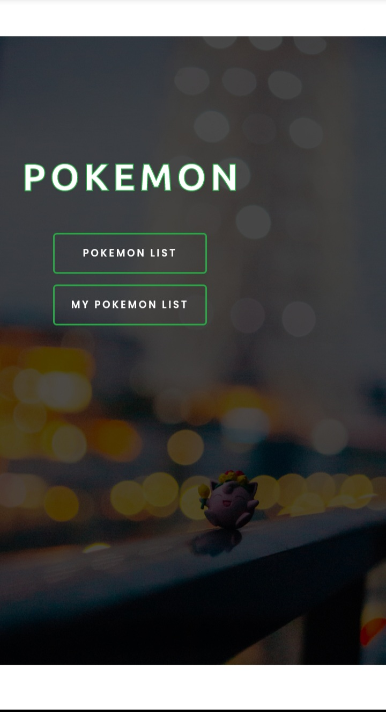
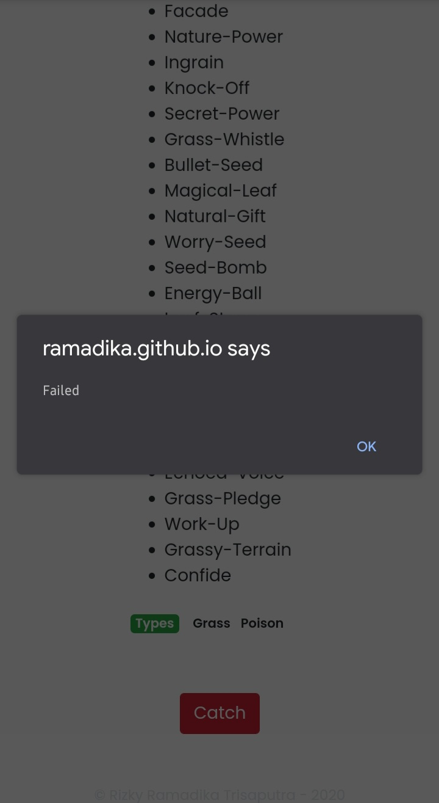

<h1 align="center">Pokemon - Web App</h1>

  

  Built with ReactJs.

## Table of Contents

- [Introduction](#introduction)
- [Features](#features)
- [Release web](#release-web)
- [Requirements](#requirements)
- [Usage for Development](#usage-for-development)
- [Screenshots](#screenshots)

## Introduction
<b>Pokemon - Web App</b> is an web-based application to catch the Pokemon. There is a list of pokemon with their own unique moves that can be caught and then added to the catch list.

## Features
* User can see list of Pokemon
* User can see all Pokemon that have been caught by him
* Showing List of Pokemon's Names and a picture of the Pokemon
* User also can see the Owned Total of all Pokemon that have been caught by him inside Pokemon List page
* List of Pokemon can be clicked to see Pokemon detail
* Inside the Pokemon detail page, user can see a picture of the Pokemon with its moves and types
* There is a button to catch the Pokemon inside the Pokemon detail page
* if success then user can give the Pokemon a nickname and add that Pokemon to `My Pokemon List’
* Pokemon that have been caught by user can be seen inside My Pokemon List page
* Pokemon that is on My Pokemon List also be possible to remove from the list

## Release-Web
**Pokemon - Web App** can be accessed [here](https://ramadika.github.io/backup-pokemon/#/)

## Requirements
* [`npm`](https://www.npmjs.com/get-npm)
* [`reactjs`](https://reactjs.org/docs/getting-started.html)

## Usage for development
1. Open your terminal or command prompt
2. Type `git clone https://github.com/ramadika/backup-pokemon.git`
3. Open the folder and type `npm install` for install dependencies
4. Type `npm start` for run this app.

## Screenshots

    
    
    
    
    
    
    
    
    
    
    

